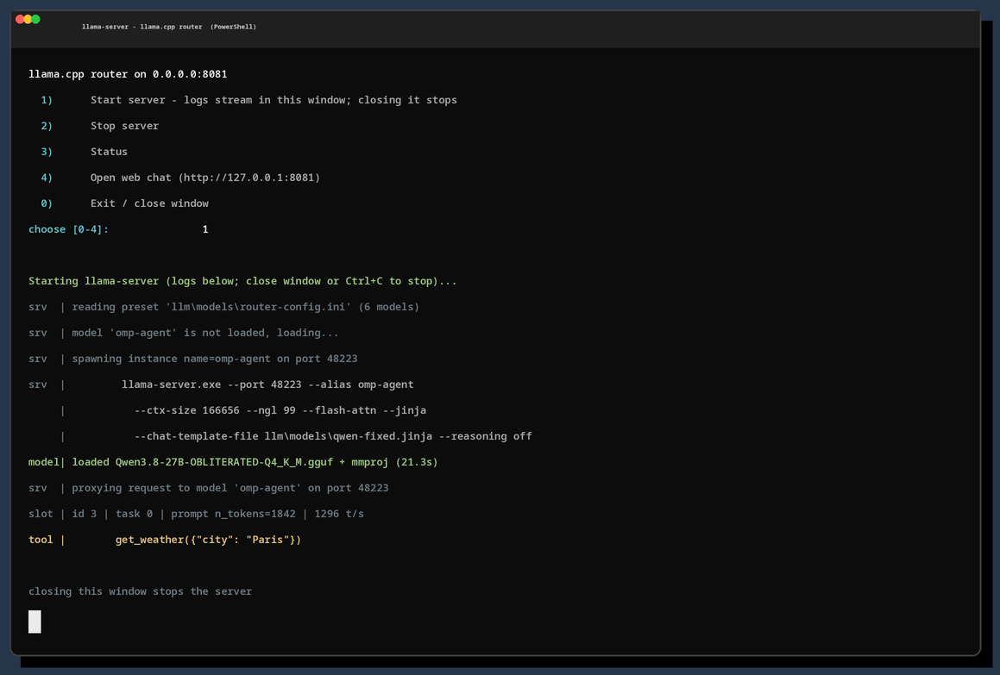

# winslopper_RTX5090TI

Windows port of natureboy's llama.cpp router setup (systemd unit + router preset + Qwen chat template). Runs the llama.cpp router on port 8081 with the same `router-config.ini` and `qwen-fixed.jinja`, controlled from a small PowerShell menu in a normal console window. No service, no auto-start: you run it on demand, and closing the window stops the server.

## Table of Contents

- [Requirements](#requirements)
- [Repository layout](#repository-layout)
- [Setup](#setup)
- [One-click release EXE](#one-click-release-exe)
- [Running the server on demand](#running-the-server-on-demand)
- [Menu](#menu)
- [Web chat (built-in)](#web-chat-built-in)
- [CLI subcommands](#cli-subcommands)
- [Interface preview](#interface-preview)
- [Upgrading llama.cpp](#upgrading-llama-cpp)
- [Firewall](#firewall)
- [systemd mapping](#systemd-mapping)
- [Troubleshooting](#troubleshooting)
- [Source files and making changes](#source-files-and-making-changes)
- [License](#license)

## Requirements

- Windows 10 (target 21H2), PowerShell 5.1 (built in). No Python, no nssm, no extra tools.
- NVIDIA GPU with a driver that supports CUDA 13.3.
- The GGUF models on the Windows disk at `C:\LLM_Models`. These are the same files Linux sees at `/mnt/windows/LLM_Models` (same physical disk, mounted by Linux for inference).
- Internet access on first setup run (downloads the llama.cpp CUDA 13.3 nightly zip, about 150 MB).

## Repository layout

```
setup-llama-server.ps1      main installer, idempotent, run on Windows
gen.py                      regenerates setup-llama-server.ps1 from src/ (build-time only)
docs/                       interface mockup image + generator
src/                        exact originals from natureboy
```

What the setup script creates inside the folder you copy:

```
llama/                      llama-server.exe + CUDA 13.3 DLLs
llm/models/router-config.ini
llm/models/qwen-fixed.jinja
llama-server.bat            launcher
llama-server.ps1            control menu
REMOVE_ME_TO_UPGRADE        upgrade lock
llama-server.lnk            desktop shortcut (created by setup)
```

## Setup

1. Copy this folder to Windows as one folder (it is relocatable; paths regenerate on re-run).
2. Confirm the models are present at `C:\LLM_Models`.
3. Open PowerShell in the folder and run:

   ```powershell
   powershell -ExecutionPolicy Bypass -File .\setup-llama-server.ps1
   ```

   Optional flags:

   - `-LlamaZip C:\path\llama-bXXXXXn-bin-win-cuda-13.3-x64.zip` reuses a zip you already downloaded instead of downloading.
   - `-ModelsDir D:\LLM_Models` if the models live elsewhere.
   - `-Build bXXXXX` to pick a specific nightly for the first install.
   - `-SkipFirewall` / `-NoShortcut` to skip the firewall rule / desktop shortcut.
   - Run from an elevated PowerShell if you want the inbound firewall rule created.

   Re-running is safe (idempotent): the build is skipped when unchanged, and the config, template, launcher and menu are rewritten deterministically.

## One-click release EXE

Pushing a tag (`v*`) triggers the `release-sfx.yml` GitHub Actions workflow: it regenerates and verifies the setup script, downloads the pinned llama.cpp CUDA 13.3 zip, verifies its SHA-256 against the GitHub API, and assembles a self-extracting EXE that embeds the zip and the setup script. The EXE installs everything to `%USERPROFILE%\winslopper_RTX5090TI` (unelevated) and then runs exactly like the folder install. Downloads and the plain `.ps1` remain the manual alternative.

SmartScreen: the EXE is unsigned, so Windows shows "Windows protected your PC" once (More info > Run anyway). This is expected for personal builds; a paid code-signing certificate is the only way to suppress it. Always compare the published SHA-256 before running, and prefer running the `.ps1` path if you distrust the artifact.

## Running the server on demand

No service and no auto-start. Run it when you need it:

- Double-click the `llama-server` shortcut on your desktop (created by setup; uses the PowerShell system icon), or
- Double-click `llama-server.bat`, or
- Run `.\llama-server.bat` from a terminal.

A console window opens with the menu. Option 1 starts the router in that same window and its logs stream there. Close the window or press Ctrl+C and the server stops.

Point OpenAI-compatible clients (omp, opencode, etc.) at `http://127.0.0.1:8081/v1` with model `omp-agent`, `opencode-agent` or `qwen-chat`.

## Menu

```
llama.cpp router on 0.0.0.0:8081
  1) Start server - logs stream in this window; closing it stops
  2) Stop server
  3) Status
  4) Open web chat (http://127.0.0.1:8081)
  0) Exit / close window
choose [0-4]: 1
```

- `1` starts the router in this window. The first request to a model loads it (10 to 40 seconds).
- `2` stops it immediately (the router and any child model servers).
- `3` shows `running ({"status":"ok"})` or `stopped`.
- `4` opens the built-in web chat in your browser (see below).
- `0` closes the window.

## Web chat (built-in)

llama.cpp's web UI is served by llama-server itself at `http://127.0.0.1:8081/` (menu option 4, or `.\llama-server.ps1 web`). It is not a separate process, so it cannot be started or stopped on its own: when the server is running the chat is up, and stopping the server closes it. Option 4 only opens the browser when the server is running and its `/health` endpoint reports `ok`, and it prints the URL before launching.

It is a ChatGPT-style chat: streaming replies, markdown, a model dropdown listing the router's presets, and image input for the vision models (`qwen-chat` is Qwen3.8-27B-OBLITERATED + mmproj). Pick `qwen-chat` in the dropdown; the UI remembers your last model.

Compared to Open WebUI it is intentionally simpler: single user, no accounts, history stays in the browser, no plugin ecosystem. It needs no Docker or Podman on the Windows machine.

## CLI subcommands

```powershell
.\llama-server.ps1 start | stop | restart | status | web
```

## Interface preview



## Upgrading llama.cpp

- While `REMOVE_ME_TO_UPGRADE` exists, setup never checks for a newer nightly and makes no network calls.
- To upgrade, delete `REMOVE_ME_TO_UPGRADE` and re-run setup. It resolves the latest nightly from the GitHub API (or use `-Build bXXXXX` to pin one), replaces `llama\`, and re-creates the lock.
- `-Force` reinstalls the current build.

## Firewall

- The server binds `0.0.0.0:8081`. For localhost use no rule is needed.
- To reach it from other machines, run setup from an elevated PowerShell so the inbound TCP 8081 rule is created.
- CORS is all-origin and no API key is set, same as the Linux side.

## systemd mapping

| systemd (Linux unit) | Windows equivalent |
| --- | --- |
| `Type=simple` + `ExecStart` | menu option 1 (foreground console) |
| `Restart=always` / `RestartSec=10` | none; closing the window stops it |
| `LimitMEMLOCK=infinity` | none (router mode does not use `--mlock`) |
| `WantedBy=default.target` | none; run on demand via the shortcut |

## Troubleshooting

- Models reported missing: setup prints the missing paths; check `-ModelsDir`.
- Windows Firewall prompt on first start: click Allow, or run setup elevated for the rule.
- Port 8081 already in use: the router fails to bind; find and stop the other process.
- "llama-server is already running": a leftover process; use menu option 2, close the window, or `taskkill /IM llama-server.exe /F`.
- Health check: `http://127.0.0.1:8081/health`; web UI: `http://127.0.0.1:8081`.

## Source files and making changes

- `src/router-config.ini` and `src/qwen-fixed.jinja` are the Linux originals from natureboy and the source of truth. Edit them, run `python3 gen.py`, then commit both the edited `src/` file and the regenerated `setup-llama-server.ps1`.
- `gen.py` translates `/mnt/windows/LLM_Models/...` to the Windows models dir and `/home/wfoster/llm/models/qwen-fixed.jinja` to the local template path, embeds both byte-for-byte, and stamps the template SHA into the script. The Windows setup writes them out and verifies the written template against that SHA, so edits in `src/` flow through automatically.
- `src/llama-server.service`: the original systemd unit, reference only (not consumed by `gen.py`).

## License

This repository is MIT licensed (see `LICENSE`), matching the license of the llama.cpp binaries it redistributes. Third-party components used by the release EXE (llama.cpp binaries, the 7-Zip SFX module that builds the self-extractor, and the Qwen chat template) are covered in `THIRD_PARTY_NOTICES.md`.
